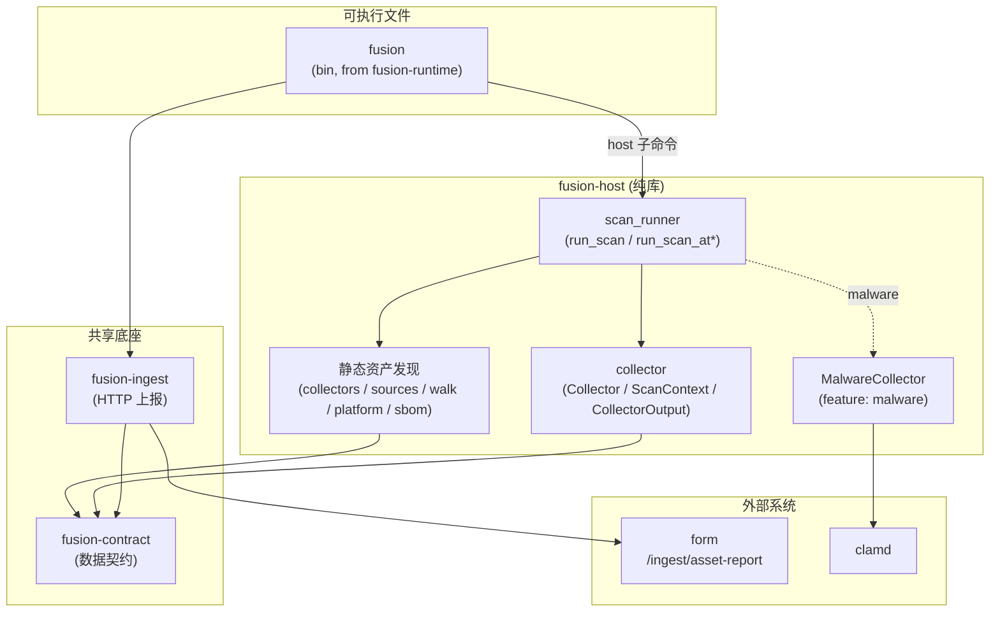
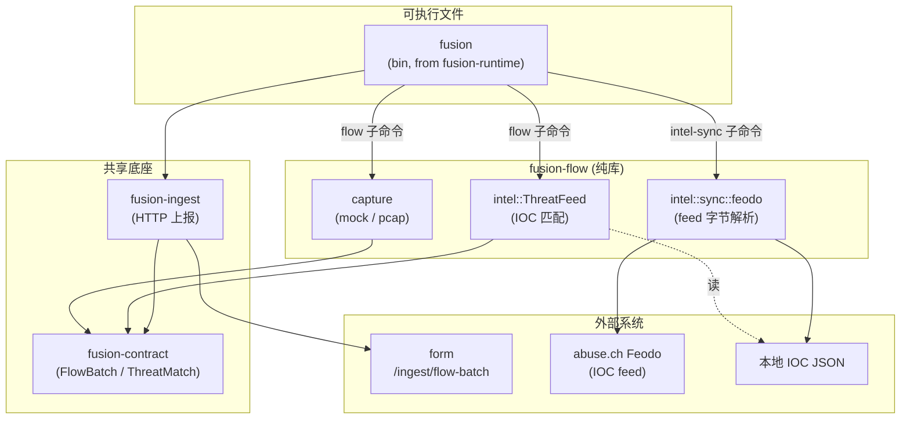

# fusion 架构

posture 的采集探针。fusion **只负责采集**（被调度的本机检测工具集）；CVE / 包漏洞识别与跨源关联分析由 **form** 侧完成。

唯一对外二进制是 `fusion`（来自 `fusion-runtime`），通过子命令调度各数据域的进程内模块：

- `fusion host` — 主机资产扫描（产出 `AssetReport`）
- `fusion flow` — 网络流采集 + IOC 匹配（产出 `FlowBatch`）
- `fusion intel-sync` — 下载 IOC feed 写本地 JSON

> **跨机投放由 form（`form-scan`）负责**：把 fusion 上传到待测机器、调用它、取回结果，现在是 form 侧 `form-scan`（Python）的职责，不再属于 fusion。`fusion-runtime` 只调度本机 / 目标机上的进程内模块。

## 双轴模型

fusion 用两个**正交**维度组织能力与文档，二者不互相替代：

| 轴 | 含义 | 划分依据 |
| --- | --- | --- |
| **数据域** | 观测对象与上报 envelope | 主机（内视 → `AssetReport`）· 网络（外视 → `FlowBatch`） |
| **运行模式** | 调度与部署方式 | 周期性（快照 / cron / 一次性 CLI）· 持续性（长驻 / 流式近实时） |

**数据域**决定 schema、ingest 路径、form 分析链路，也是 workspace crate 的主划分依据。
**运行模式**决定子命令如何部署（定时任务、手动扫描、边缘 daemon），不改变 envelope 类型。

### 能力矩阵

|  | 周期性 | 持续性 |
| --- | --- | --- |
| **主机** | `fusion host`（含 `--malware` ClamAV） | *未实现*（未来：配置漂移、FIM 等） |
| **网络** | `fusion flow`（mock 默认）、`fusion intel-sync` | `fusion flow --pcap`（定长或扩展为 daemon） |

### 数据域概览

- **主机域（host / 内视）**：对挂载根或本机做静态资产与风险采集，产出 `AssetReport`。
- **网络域（flow / 外视）**：旁路采集流量元数据并做威胁情报 IOC 初步匹配，产出 `FlowBatch`。

两个数据域是 **独立的权限足迹**（文件系统 / clamd vs libpcap / root），且分别由 `host` / `flow` feature 控制是否编入 `fusion` 二进制；它们 **共享** `fusion-contract`（数据契约）与 `fusion-ingest`（上报客户端），后者对两种 envelope 泛型。靠 feature 裁剪，只做主机扫描的精简 agent 不会牵入抓包依赖。

```
                ┌──────────────── fusion (runtime) ─────────────────────┐
  [周期] 主机扫描 ──►│  fusion host   → host 域模块 (+--malware ClamAV)    │──► AssetReport
                │                                                      │
  [周期] intel ──►│  fusion intel-sync → 本地 IOC JSON                  │
  [周期|持续] 流 ──►│  fusion flow   → flow 域模块 (mock | pcap)         │──► FlowBatch
                └──── 共享 fusion-contract / fusion-ingest ─────────────┘
                                    │                    │
                                    ▼                    ▼
                         /ingest/asset-report    /ingest/flow-batch  →  form
```

---

# 主机域（host / 内视 · 周期性）

## 组件关系



## fusion host 子命令

```
fusion host [-r/--root ROOT] [-t/--target TARGET] [输出/上报旗标] [--malware ...]
```

| 旗标 | 说明 |
| --- | --- |
| `-r` / `--root` | 挂载根或本机 `/`（`scan_root`） |
| `-t` / `--target` | `host` / `packages` / `sbom` / `services` / `accounts` / `credentials` / `identity` / `all` |
| `--project-root` | 语言包额外项目目录（可与自动发现合并） |
| `--windows-packages` | `full`（默认）/ `apps` |
| `--malware` | 追加 ClamAV 查杀（需 `malware` feature） |
| `--malware-jobs` / `--clamd-socket` | ClamAV 并发与 clamd socket |

输出有两种形态：

- **分文件 JSON**（`-o DIR`）：经 `run_static_scan` 按类别写出 `host.json` / `packages.json` / `sbom.cyclonedx.json` / `services.json` / `accounts.json` / `credentials.json`；`--malware` 另写 `malware.json`。供调试或 form 拉取后再组装。
- **合并 `AssetReport`**（不带 `-o`）：输出到 stdout（`--pretty`）/ 文件（`--report-out FILE`）/ form（`--upload URL`）。`--malware` 命中并入 `vulnerabilities`。

## 数据流

**运行模式**：周期性 — 每次 invocation 完成一次完整扫描并退出。
未来若增加长驻主机 agent，仍产出同一 `AssetReport` envelope，仅 cadence 变为持续性。

```
挂载目录 / 本机根 (scan_root)
        │
        ▼
  Collector 计划 (Host → Packages → Services → …)
        │
        ▼
   AssetReport (JSON)
        │
        ├── stdout (--pretty) / --report-out 文件 / 分文件 (-o DIR)
        └── POST /ingest/asset-report → form (--upload)
```

## Collector 模型

一次扫描周期内，各 `Collector` 共享 [`ScanContext`](../crates/host/src/collector.rs)（定义在 host crate 的 `crate::collector`）：

| 字段 | 含义 |
| --- | --- |
| `scan_root` | 挂载根或 `/` |
| `host_id` / `host` | 由 `HostCollector` 填充，后续 collector 依赖 |
| `project_roots` | 语言包额外项目目录（venv / `node_modules`） |

`Collector::collect` 返回 [`CollectorOutput`](../crates/host/src/collector.rs) 之一：

- `Host(HostInfo)` — 主机描述
- `Assets(Vec<Asset>)` — 包、服务、账户、凭证等
- `Vulnerabilities(Vec<Vulnerability>)` — ClamAV 命中等

[`run_scan_at`](../crates/host/src/scan_runner.rs) 顺序执行 collector，合并为 [`AssetReport`](../crates/contract/src/lib.rs)。

> 命名提示：`Collector` trait 指「一类资产采集单元」，与网络组件（flow 域）无关——这个词不再被任何组件名重载。

## host crate 内部分层

`fusion-host` 把「全部主机检测」收纳在一个纯库里，用两个正交轴组织代码：

| 轴 | 模块 | 说明 |
| --- | --- | --- |
| **对外：资产语义** | `collectors/` | `HostCollector`、`PackagesCollector` 等；产出 `AssetReport` 字段 |
| **对内：采集策略** | 见下表 | 决定如何从挂载根找到数据 |

| 策略 | 路径 | 典型数据源 |
| --- | --- | --- |
| OS 强相关 | `platform/`、`platform/windows/` | 注册表 hive、SAM、live HKLM |
| 固定路径 | `sources/` | `etc/os-release`、`var/lib/dpkg/status`、全局 `node_modules` |
| 有界遍历 | `walk/` + `walk/handlers/` | project root markers、`.dist-info`、`Users/*/.ssh` |

调度抽象（`collector` / `scan_runner`）与查杀（`malware`，在 `malware` feature 后）也都在同一 crate，按 feature 裁剪。

数据流（Linux 包采集示例）：

```
PackagesCollector (collectors/packages/)
    ├── sources/packages/dpkg|apk|rpm   ← 固定 DB 路径
    ├── sources/packages/pypi|npm       ← 全局路径 + walk project walk
    └── platform/windows/collect_packages (Windows 分支)
```

`discover_project_roots` 从 crate 根导出（`walk/markers`），供 `fusion host --project-root` 自动发现合并。

## 默认采集计划

`fusion_host::default_collectors()`（按 [`platform::detect`](../crates/host/src/platform/mod.rs) 分派 Linux / Windows 实现）：

1. `HostCollector` — Linux: `etc/hostname`、`etc/os-release`；Windows: SYSTEM/SOFTWARE 注册表（含 DisplayVersion / UBR）
2. `PackagesCollector` — Linux: dpkg / apk / rpm / PyPI / npm；Windows: Uninstall + WinGet + CBS + AppX + Chocolatey + PyPI / npm
3. `ServicesCollector` — Linux: systemd + SysV；Windows: SYSTEM\\Services（Win32 服务，Start → enabled/manual/disabled）
4. `AccountsCollector` — Linux: `/etc/passwd`；Windows: SAM 用户名 + RID + ProfileList 路径
5. `CredentialsCollector` — SSH 公钥指纹（Linux: `etc/ssh` + `walk/handlers/ssh_home`；Windows: `ProgramData/ssh` + `Users/*/.ssh`）

`fusion host --malware`（需 `malware` feature）时，计划追加 `MalwareCollector`（ClamAV `INSTREAM`），其 `Vulnerability` 在合并模式汇入 `AssetReport`，分文件模式另写 `malware.json`。

## Feature 矩阵（host）

`fusion-host` 自身的 features：

| Feature | 默认 | 说明 |
| --- | --- | --- |
| `default` | `[]` | 静态资产发现（无外部联动） |
| `malware` | | ClamAV `INSTREAM` 查杀（`MalwareCollector`） |

在 `fusion-runtime` 侧由 `host` / `malware`（`malware → host/malware`）/ `full` 组合开启，详见下方 [Crate 职责总表](#crate-职责总表)。

## 扩展新采集器

1. 在 `fusion-host` 的 `collectors/` 实现 `Collector`
2. 将实例加入 `default_collectors()`（或在 `fusion-runtime` 的 host 子命令组装计划处接入）
3. 若产出新 asset 类型，先在 form schema 与 `fusion-contract` 中扩展
4. 在 [`crates/host/tests/contract.rs`](../crates/host/tests/contract.rs) 补充契约校验

---

# 网络域（flow / 外视 · 周期性 + 持续性）

## 组件关系



> `fusion-flow` 是**纯库**：不含 CLI / HTTP / ingest，CLI 与上报都在 `fusion-runtime` 的 `flow` / `intel-sync` 子命令里组装。

## fusion flow / intel-sync 子命令

`fusion flow`：capture → IOC 匹配 → `FlowBatch`。

| 旗标 | 说明 |
| --- | --- |
| `--mock`（默认） | 合成流，无需 root，适合 CI / 离线演示 |
| `--pcap` | libpcap 实时抓包（需 `pcap` feature） |
| `--iface` / `--duration` / `--bpf` / `--list-devices` | pcap 后端参数 |
| `--intel PATH` | 只读本地 IOC JSON（匹配不联网） |
| `--pretty` / `-o`/`--out FILE` / `--upload URL` | 输出 / 上报 |

`fusion intel-sync`：下载 IOC feed → 本地 JSON。

| 旗标 | 说明 |
| --- | --- |
| `--source NAME` | feed 源名（可重复，**必填**） |
| `-o` / `--out` | 输出 JSON 路径 |
| `--feodo-url` / `--timeout` | feodo 源 URL 与超时 |

## 数据流

**运行模式**：

| 模式 | 子命令 | 说明 |
| --- | --- | --- |
| 周期性 | `fusion flow`（mock 默认） | 合成流 → 匹配 → 输出 / 上报，适合 CI 与离线演示 |
| 周期性 | `fusion intel-sync` | cron 拉取 IOC feed → 本地 JSON；采集时 `--intel` 只读本地库 |
| 持续性 | `fusion flow --pcap` | libpcap 长时抓包（`--duration`）；可扩展为无退出 daemon |

```
网卡 / mock 合成流
        │
        ▼
  capture 后端 (mock 默认 | pcap 实时) ── 五元组聚合 ──► Vec<FlowEvent>
        │
        ▼
  ThreatFeed::enrich  ── 对本地 IOC 库匹配 (IP / 域名 / JA3) ──► 注入 threat_intel
        │
        ▼
   FlowBatch (JSON)
        │
        ├── stdout (--pretty) / --out 文件
        └── POST /ingest/flow-batch → form （按 IOC 聚合关联成 Alert）
```

- **捕获后端**：`mock`（默认，合成 HTTPS/DNS/SSH/ICMP 四类典型流，无需 root）与
  `pcap`（feature `pcap`，libpcap 实时抓包 + 五元组聚合 + DNS/TLS SNI/JA3 解析）。
  两者返回同一 `Vec<FlowEvent>`，上层不变。
- **威胁情报初步处理**：`ThreatFeed` 把每条流对照本地 IOC 库匹配，命中以 `ThreatMatch`
  写入 `FlowEvent.threat_intel`——在上报前先把「线上观测」与「已知恶意」关联好，form
  拿到后直接据此做告警关联，无需重复查表。
- **情报同步（`fusion intel-sync`）**：离线友好——同步是独立、可定时（cron）的步骤，
  从 abuse.ch Feodo 等拉取 IOC 写本地 JSON；采集时 `--intel` 只读本地库，匹配不联网。

## 扩展新情报源

1. 在 [`crates/flow/src/intel/sync/`](../crates/flow/src/intel/sync/) 下实现一个 feed 字节解析器（参考 [`feodo.rs`](../crates/flow/src/intel/sync/feodo.rs)）
2. 在 `fusion intel-sync` 的 `--source` 分发中接入
3. 产出对齐 `ThreatFeed` 的本地 JSON（`type` / `value` / `category` / `severity`）

---

# 共享底座

## 数据契约（fusion-contract）

`fusion-contract` 是 `form/schemas-json/` 的 Rust 镜像，**同时持有两种 envelope**，且**零内部依赖**（依赖 DAG 的汇点）：

- 主机：`AssetReport` / `HostInfo` / `Asset`（package/service/port/account/credential）/ `Vulnerability`
- 网络：`FlowBatch` / `FlowEvent` / `FlowProto` / `ThreatMatch` / `IndicatorType`
- 两侧共享一份 `Severity`（`info … critical`，可比较）

| 层级 | 路径 |
| --- | --- |
| 权威来源 | `form/src/form/schemas/`（Pydantic） |
| JSON Schema | `form/schemas-json/` |
| Rust 镜像 | [`crates/contract/src/lib.rs`](../crates/contract/src/lib.rs) |
| 校验测试 | [`crates/host/tests/contract.rs`](../crates/host/tests/contract.rs)（`AssetReport`）、[`crates/flow/tests/contract.rs`](../crates/flow/tests/contract.rs)（`FlowBatch`） |

新增字段：先改 form Pydantic 模型 → `form-export-schemas` 重生成 JSON Schema → 在
`fusion-contract` 加对应 Rust 字段 → `cargo test` 验证（集成测试用 `jsonschema` 校验真实输出）。

## 上报客户端（fusion-ingest）

一个 blocking HTTP 客户端，对两种 envelope 泛型，仅依赖 `fusion-contract`：

- `upload_report(&AssetReport, base)` → `POST <base>/ingest/asset-report`
- `upload_batch(&FlowBatch, base)` → `POST <base>/ingest/flow-batch`

共享内部 `post_json`：构建 client、超时、`FORM_API_TOKEN` Bearer 鉴权、`202 Accepted` 判定成功。不依赖任何捕获 / 抓包 crate。

## Crate 职责总表

5 个**扁平** crate，位于 `crates/` 下，每个目录就是一个 crate（无嵌套子 crate）：

| Crate | 目录 | 类型 | 依赖 | 职责 |
| --- | --- | --- | --- | --- |
| `fusion-contract` | `crates/contract/` | 库 | （无，DAG 汇点） | 数据契约：`AssetReport` + `FlowBatch` + 共享 `Severity`，与 `form/schemas-json/` 对齐 |
| `fusion-ingest` | `crates/ingest/` | 库 | contract | 阻塞式 HTTP 上报：`upload_report` / `upload_batch`，`FORM_API_TOKEN` Bearer，202 为成功 |
| `fusion-host` | `crates/host/` | 库 | contract | 全部主机检测：静态资产发现 + 调度抽象（`Collector` / `ScanContext` / `run_scan*`）+ ClamAV 查杀（feature `malware`） |
| `fusion-flow` | `crates/flow/` | 库 | contract | 网络流：capture（mock / `pcap`）+ IOC 匹配（`ThreatFeed`）+ feed 解析（`intel::sync::feodo`） |
| `fusion-runtime` | `crates/runtime/` | bin（`fusion`） | contract、ingest、host?、flow?、reqwest? | `fusion` 编排二进制：`host` / `flow` / `intel-sync` 子命令调度各域模块 |

依赖 DAG（单向无环）：`contract ← ingest`；`contract ← host`；`contract ← flow`；`{contract, ingest, host, flow} ← runtime`。

`fusion-runtime` features：`default = [host, flow]`；`host`；`flow`；`malware → host/malware`；`pcap → flow/pcap`；`full = [host, flow, malware]`。

> **物理结构是 5 个扁平 crate** + 1 个共享底座 `contract`（再加上报客户端 `ingest`）。这与上方「双轴模型」是两件事——双轴（数据域 × 运行模式）是**概念**视角，扁平 crate 是 **workspace 物理分层**。`malware` 不再是独立 crate / 二进制，而是 `host` 的一个 feature（按 clamd 权限足迹可选启用）；`runtime` 是唯一二进制，按 feature 决定编入哪些域。

---

# 代表性命令

```sh
cargo run -p fusion-runtime -- host -r / --pretty                                   # 合并 AssetReport → stdout
cargo run -p fusion-runtime -- host -r / -t all -o ./scan-out                       # 分文件 JSON
cargo run -p fusion-runtime --features full -- host -r / --malware --pretty         # 含 ClamAV 查杀
cargo run -p fusion-runtime -- host -r / -t all --upload http://127.0.0.1:8000      # 扫描并上报 form
cargo run -p fusion-runtime -- flow --pretty                                        # FlowBatch（mock 默认）
cargo run -p fusion-runtime -- flow --intel data/feeds/feodo.json --upload http://127.0.0.1:8000
cargo build -p fusion-runtime --features pcap                                       # 启用实时抓包
sudo cargo run -p fusion-runtime --features pcap -- flow --pcap --iface eth0 --duration 30 --bpf "tcp port 443" --pretty
cargo run -p fusion-runtime -- intel-sync --source feodo --out data/feeds/feodo.json
# 精简主机 agent（不牵 flow / pcap）：产物为单一 fusion 二进制
cargo build -p fusion-runtime --no-default-features --features host,malware --target x86_64-unknown-linux-musl --release
```

> **边界提醒**：fusion **只采集**本机 / 目标机的本地检测结果；CVE 判定与跨源关联在 **form** 侧。**跨机投放 / 调用 / 取回**由 form 的 `form-scan`（Python）负责，不属于 fusion。

详见 [`CONTRIBUTING.md`](./CONTRIBUTING.md)。
