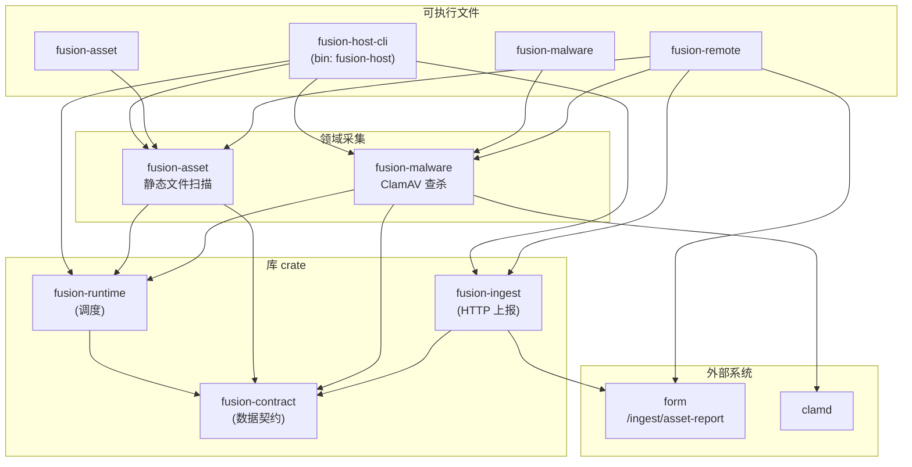
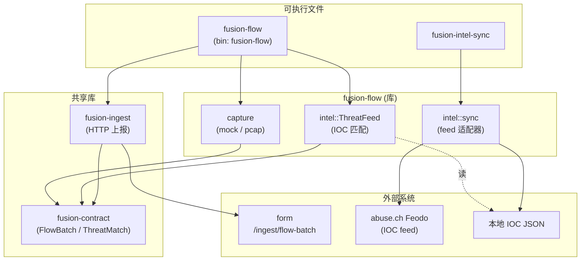

# fusion 架构

posture 的采集探针。fusion **只负责采集**；CVE / 包漏洞识别与跨源关联分析由 **form** 侧完成。

## 双轴模型

fusion 用两个**正交**维度组织能力与文档，二者不互相替代：

| 轴 | 含义 | 划分依据 |
| --- | --- | --- |
| **数据域** | 观测对象与上报 envelope | 主机（内视 → `AssetReport`）· 网络（外视 → `FlowBatch`） |
| **运行模式** | 调度与部署方式 | 周期性（快照 / cron / 一次性 CLI）· 持续性（长驻 / 流式近实时） |

**数据域**决定 schema、ingest 路径、form 分析链路，也是 workspace crate 的主划分依据。
**运行模式**决定二进制如何部署（定时任务、手动扫描、边缘 daemon），不改变 envelope 类型。

### 能力矩阵

|  | 周期性 | 持续性 |
| --- | --- | --- |
| **主机** | `fusion-asset`、`fusion-host-cli`、`fusion-malware`、`fusion-remote` | *未实现*（未来：配置漂移、FIM 等） |
| **网络** | `fusion-flow`（mock）、`fusion-intel-sync` | `fusion-flow --pcap`（定长或扩展为 daemon） |

### 数据域概览

- **主机域（fusion-host / 内视）**：对挂载根或本机做静态资产与风险采集，产出 `AssetReport`。
- **网络域（fusion-flow / 外视）**：旁路采集流量元数据并做威胁情报 IOC 初步匹配，产出 `FlowBatch`。

两个数据域是 **独立的权限足迹**（文件系统 / clamd vs libpcap / root），编译为各自的二进制；它们 **共享** `fusion-contract`（数据契约）与 `fusion-ingest`（上报客户端），后者对两种 envelope 泛型，所以只做主机扫描的二进制不会牵入抓包依赖。

```
                ┌──────────────── fusion ───────────────────────────────┐
  [周期] 主机批扫 ──►│  fusion-host / fusion-asset / -malware            │──► AssetReport
                │  fusion-remote (SSH / WinRM 投放)                    │
                │                                                      │
  [周期] intel ──►│  fusion-intel-sync → 本地 IOC JSON                  │
  [周期|持续] 流 ──►│  fusion-flow (库 + bin, mock | pcap)              │──► FlowBatch
                └──── 共享 fusion-contract / fusion-ingest ─────────────┘
                                    │                    │
                                    ▼                    ▼
                         /ingest/asset-report    /ingest/flow-batch  →  form
```

---

# 主机域（fusion-host / 内视 · 周期性）

## 组件关系



## 数据流

**运行模式**：周期性 — 每次 invocation 完成一次完整扫描并退出（或远端拉取 JSON 后清理）。
未来若增加长驻主机 agent，仍产出同一 `AssetReport` envelope，仅 cadence 变为持续性。

```
挂载目录 / 本机根 (scan_root)
        │
        ▼
  Collector 计划 (Host → Packages → Services → …)
        │
        ▼
   AssetReport (JSON)
        │
        ├── stdout / --out 文件
        └── POST /ingest/asset-report → form
```

**静态扫描**（`fusion-asset`）也可按类别写出分文件 JSON（`host.json`、`packages.json` 等），供调试或远端拉取后再组装。

## Collector 模型

一次扫描周期内，各 `Collector` 共享 [`ScanContext`](../crates/runtime/fusion-runtime/src/collector.rs)：

| 字段 | 含义 |
| --- | --- |
| `scan_root` | 挂载根或 `/` |
| `host_id` / `host` | 由 `HostCollector` 填充，后续 collector 依赖 |
| `project_roots` | 语言包额外项目目录（venv / `node_modules`） |

`Collector::collect` 返回 [`CollectorOutput`](../crates/runtime/fusion-runtime/src/collector.rs) 之一：

- `Host(HostInfo)` — 主机描述
- `Assets(Vec<Asset>)` — 包、服务、账户、凭证等
- `Vulnerabilities(Vec<Vulnerability>)` — ClamAV 命中等

`run_scan_at` 顺序执行 collector，合并为 [`AssetReport`](../crates/fusion-contract/src/lib.rs)。

> 命名提示：`fusion-runtime` 的 `Collector` trait 指「一类资产采集单元」，与网络组件
> （`fusion-flow`）无关——合并后 “collector” 这个词不再被组件名重载。

## fusion-asset 内部分层

`fusion-asset` 用两个正交轴组织代码：

| 轴 | 模块 | 说明 |
| --- | --- | --- |
| **对外：资产语义** | `collectors/` | `HostCollector`、`PackagesCollector` 等；产出 `AssetReport` 字段 |
| **对内：采集策略** | 见下表 | 决定如何从挂载根找到数据 |

| 策略 | 路径 | 典型数据源 |
| --- | --- | --- |
| OS 强相关 | `platform/`、`platform/windows/` | 注册表 hive、SAM、live HKLM |
| 固定路径 | `sources/` | `etc/os-release`、`var/lib/dpkg/status`、全局 `node_modules` |
| 有界遍历 | `walk/` + `walk/handlers/` | project root markers、`.dist-info`、`Users/*/.ssh` |

数据流（Linux 包采集示例）：

```
PackagesCollector (collectors/)
    ├── sources/packages/dpkg|apk|rpm   ← 固定 DB 路径
    ├── sources/packages/pypi|npm       ← 全局路径 + walk/registry project walk
    └── platform/windows/collect_packages (Windows 分支)
```

`discover_project_roots` 从 crate 根导出（`walk/markers`），供 CLI `--project-root` 自动发现合并。

## 默认采集计划

`fusion-asset::default_collectors()`（按 [`platform::detect`](../crates/host/fusion-asset/src/platform/mod.rs) 分派 Linux / Windows 实现）：

1. `HostCollector` — Linux: `etc/hostname`、`etc/os-release`；Windows: SYSTEM/SOFTWARE 注册表（含 DisplayVersion / UBR）
2. `PackagesCollector` — Linux: dpkg / apk / rpm / PyPI / npm；Windows: Uninstall + WinGet + CBS + AppX + Chocolatey + PyPI / npm
3. `ServicesCollector` — Linux: systemd + SysV；Windows: SYSTEM\\Services（Win32 服务，Start → enabled/manual/disabled）
4. `AccountsCollector` — Linux: `/etc/passwd`；Windows: SAM 用户名 + RID + ProfileList 路径
5. `CredentialsCollector` — SSH 公钥指纹（Linux: `etc/ssh` + `walk/handlers/ssh_home`；Windows: `ProgramData/ssh` + `Users/*/.ssh`）

启用 `malware` feature 时，`fusion-host-cli` 追加 `MalwareCollector`。

## Feature 矩阵（fusion-host-cli）

| Feature | 默认 | 说明 |
| --- | --- | --- |
| `asset` | ✓ | 静态资产采集 |
| `malware` | | ClamAV 查杀 |
| `ingest` | | `--upload` 上报 form |
| `full` | | `asset` + `malware` |

## 扩展新采集器

1. 在对应 domain crate（或新建 crate）实现 `Collector`
2. 将实例加入 `default_collectors()` 或 `fusion-host-cli::build_plan`
3. 若产出新 asset 类型，先在 form schema 与 `fusion-contract` 中扩展
4. 在 `runtime/fusion-runtime/tests/contract.rs` 补充契约校验

---

# 网络域（fusion-flow / 外视 · 周期性 + 持续性）

## 组件关系



## 数据流

**运行模式**：

| 模式 | 组件 | 说明 |
| --- | --- | --- |
| 周期性 | `fusion-flow`（mock 默认） | 合成流 → 匹配 → 输出 / 上报，适合 CI 与离线演示 |
| 周期性 | `fusion-intel-sync` | cron 拉取 IOC feed → 本地 JSON；采集时 `--intel` 只读本地库 |
| 持续性 | `fusion-flow --pcap` | libpcap 长时抓包（`--duration`）；可扩展为无退出 daemon |

```
网卡 / mock 合成流
        │
        ▼
  capture 后端 (mock 默认 | pcap 实时) ── 五元组聚合 ──► Vec<FlowEvent>
        │
        ▼
  ThreatFeed::enrich  ── 对本地 IOC 库匹配 (IP / 域名 / JA3) ──► 注入 threat_intel
        │
        ▼
   FlowBatch (JSON)
        │
        ├── stdout / --out 文件
        └── POST /ingest/flow-batch → form （按 IOC 聚合关联成 Alert）
```

- **捕获后端**：`mock`（默认，合成 HTTPS/DNS/SSH/ICMP 四类典型流，无需 root）与
  `pcap`（feature `pcap`，libpcap 实时抓包 + 五元组聚合 + DNS/TLS SNI/JA3 解析）。
  两者返回同一 `Vec<FlowEvent>`，上层不变。
- **威胁情报初步处理**：`ThreatFeed` 把每条流对照本地 IOC 库匹配，命中以 `ThreatMatch`
  写入 `FlowEvent.threat_intel`——在上报前先把「线上观测」与「已知恶意」关联好，form
  拿到后直接据此做告警关联，无需重复查表。
- **情报同步（fusion-intel-sync）**：离线友好——同步是独立、可定时（cron）的步骤，
  从 abuse.ch Feodo 等拉取 IOC 写本地 JSON；采集时 `--intel` 只读本地库，匹配不联网。

## 扩展新情报源

1. 在 `fusion-flow/src/intel/sync/` 下实现一个 feed 适配器（参考 `feodo.rs`）
2. 在 `fusion-intel-sync` 的 `--source` 分发中接入
3. 产出对齐 `ThreatFeed` 的本地 JSON（`type` / `value` / `category` / `severity`）

---

# 共享基础设施

## 数据契约（fusion-contract）

`fusion-contract` 是 `form/schemas-json/` 的 Rust 镜像，**同时持有两种 envelope**：

- 主机：`AssetReport` / `HostInfo` / `Asset`（package/service/port/account/credential）/ `Vulnerability`
- 网络：`FlowBatch` / `FlowEvent` / `FlowProto` / `ThreatMatch` / `IndicatorType`
- 两侧共享一份 `Severity`（`info … critical`，可比较）

| 层级 | 路径 |
| --- | --- |
| 权威来源 | `form/src/form/schemas/`（Pydantic） |
| JSON Schema | `form/schemas-json/` |
| Rust 镜像 | `fusion-contract` |
| 校验测试 | `runtime/fusion-runtime/tests/contract.rs`、`flow/fusion-flow/tests/contract.rs` |

新增字段：先改 form Pydantic 模型 → `form-export-schemas` 重生成 JSON Schema → 在
`fusion-contract` 加对应 Rust 字段 → `cargo test` 验证（集成测试用 `jsonschema` 校验真实输出）。

## 上报客户端（fusion-ingest）

一个 blocking HTTP 客户端，对两种 envelope 泛型：

- `upload_report(&AssetReport, base)` → `POST <base>/ingest/asset-report`
- `upload_batch(&FlowBatch, base)` → `POST <base>/ingest/flow-batch`

共享 `post_json`：构建 client、超时、`FORM_API_TOKEN` Bearer 鉴权、`202 Accepted` 判定。
仅依赖 `fusion-contract`，不依赖任何捕获/抓包 crate。

## Crate 职责总表

| Crate | 目录 | 域 | 类型 | 职责 |
| --- | --- | --- | --- | --- |
| `fusion-contract` | `crates/fusion-contract/` | 底座 | 库 | 数据契约（`AssetReport` + `FlowBatch`），与 `form/schemas-json/` 对齐 |
| `fusion-runtime` | `crates/runtime/` | runtime | 库 | `Collector` trait、`ScanContext`、`run_scan_at` 调度 |
| `fusion-ingest` | `crates/runtime/` | runtime | 库 | 上报 `AssetReport` / `FlowBatch` 到 form（泛型 HTTP + 鉴权） |
| `fusion-asset` | `crates/host/` | host | 库 + bin | 静态文件系统资产发现（包、服务、账户、SBOM 等） |
| `fusion-remote` | `crates/host/` | host | 库 + bin | SSH / WinRM 投放静态 `fusion-asset`、远端执行、回传 JSON |
| `fusion-host-cli` | `crates/host/` | host | bin | 组装采集计划、输出合并报告、可选上报（bin `fusion-host`） |
| `fusion-malware` | `crates/malware/` | malware | 库 + bin | ClamAV `INSTREAM` 病毒查杀（host 子能力，`Vulnerability` 汇入 `AssetReport`） |
| `fusion-flow` | `crates/flow/` | flow | 库 + 2 bin | 流量捕获（mock/pcap）+ IOC 匹配 + 情报同步（bin `fusion-flow` / `fusion-intel-sync`） |

> **物理结构是 4+1**：4 个能力域目录（`host/` `flow/` `malware/` `runtime/`）+ 1 个独立共享底座 `fusion-contract/`。这与上方「双轴模型」是两件事——双轴（数据域 × 运行模式）是**概念**视角，4+1 是 **workspace 物理分层**。`runtime` 域是被各域依赖的基础设施（非顶层编排器）；`malware` 单列是按权限足迹（clamd）与独立二进制，数据流上是 host 域的可选采集器。

详见 [`CONTRIBUTING.md`](./CONTRIBUTING.md)。
