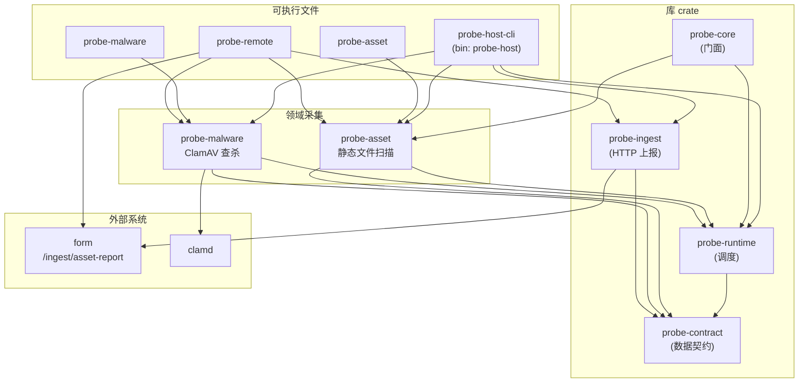
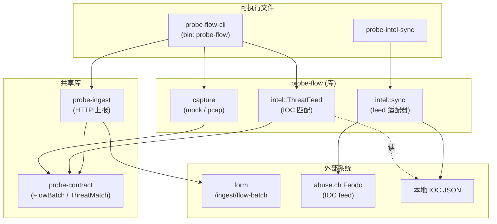

# probe 架构

cyber-posture 的采集探针，**「主机 + 网络」双维度**。probe **只负责采集**；CVE / 包漏洞识别与
跨源关联分析由 **form** 侧完成。

- **主机域（probe-host / 内视）**：对挂载根或本机做静态资产与风险采集，产出 `AssetReport`。
- **网络域（probe-flow / 外视）**：旁路采集流量元数据并做威胁情报 IOC 初步匹配，产出 `FlowBatch`。

两个领域是 **独立的运行模型**（一次性批扫 vs 长驻抓包）、独立的权限足迹（文件系统/clamd vs
libpcap/root），编译为各自的二进制；它们 **共享** `probe-contract`（数据契约）与 `probe-ingest`
（上报客户端），后者对两种 envelope 泛型，所以只做主机扫描的二进制不会牵入抓包依赖。

```
                ┌──────────────── probe ────────────────┐
   主机批扫 ───►│  probe-host / probe-asset / -malware   │──► AssetReport ─► /ingest/asset-report
                │  probe-remote (SSH 投放)               │
                │                                        │
   网络抓包 ───►│  probe-flow / probe-intel-sync         │──► FlowBatch   ─► /ingest/flow-batch
                └──── 共享 probe-contract / probe-ingest ┘                      │
                                                                                ▼  form
```

---

# 主机域（probe-host / 内视）

## 组件关系



## 数据流

```
挂载目录 / 本机根 (scan_root)
        │
        ▼
  Collector 计划 (Host → Packages → Services → …)
        │
        ▼
   AssetReport (JSON)
        │
        ├── stdout / --out 文件
        └── POST /ingest/asset-report → form
```

**静态扫描**（`probe-asset`）也可按类别写出分文件 JSON（`host.json`、`packages.json` 等），供调试或远端拉取后再组装。

## Collector 模型

一次扫描周期内，各 `Collector` 共享 [`ScanContext`](../crates/probe-runtime/src/collector.rs)：

| 字段 | 含义 |
| --- | --- |
| `scan_root` | 挂载根或 `/` |
| `host_id` / `host` | 由 `HostCollector` 填充，后续 collector 依赖 |
| `project_roots` | 语言包额外项目目录（venv / `node_modules`） |

`Collector::collect` 返回 [`CollectorOutput`](../crates/probe-runtime/src/collector.rs) 之一：

- `Host(HostInfo)` — 主机描述
- `Assets(Vec<Asset>)` — 包、服务、账户、凭证等
- `Vulnerabilities(Vec<Vulnerability>)` — ClamAV 命中等

`run_scan_at` 顺序执行 collector，合并为 [`AssetReport`](../crates/probe-contract/src/lib.rs)。

> 命名提示：`probe-runtime` 的 `Collector` trait 指「一类资产采集单元」，与网络组件
> （`probe-flow`）无关——合并后 “collector” 这个词不再被组件名重载。

## 默认采集计划

`probe-asset::default_collectors()`：

1. `HostCollector` — `etc/hostname`、`etc/os-release`、`proc/version`
2. `PackagesCollector` — dpkg / apk / rpm / PyPI / npm
3. `ServicesCollector` — systemd + SysV
4. `AccountsCollector` — `/etc/passwd`
5. `CredentialsCollector` — SSH 公钥指纹（不含私钥）

启用 `malware` feature 时，`probe-host-cli` 追加 `MalwareCollector`。

## Feature 矩阵（probe-host-cli）

| Feature | 默认 | 说明 |
| --- | --- | --- |
| `asset` | ✓ | 静态资产采集 |
| `malware` | | ClamAV 查杀 |
| `ingest` | | `--upload` 上报 form |
| `full` | | `asset` + `malware` |

## 扩展新采集器

1. 在对应 domain crate（或新建 crate）实现 `Collector`
2. 将实例加入 `default_collectors()` 或 `probe-host-cli::build_plan`
3. 若产出新 asset 类型，先在 form schema 与 `probe-contract` 中扩展
4. 在 `probe-runtime/tests/contract.rs` 补充契约校验

---

# 网络域（probe-flow / 外视）

## 组件关系



## 数据流

```
网卡 / mock 合成流
        │
        ▼
  capture 后端 (mock 默认 | pcap 实时) ── 五元组聚合 ──► Vec<FlowEvent>
        │
        ▼
  ThreatFeed::enrich  ── 对本地 IOC 库匹配 (IP / 域名 / JA3) ──► 注入 threat_intel
        │
        ▼
   FlowBatch (JSON)
        │
        ├── stdout / --out 文件
        └── POST /ingest/flow-batch → form （按 IOC 聚合关联成 Alert）
```

- **捕获后端**：`mock`（默认，合成 HTTPS/DNS/SSH/ICMP 四类典型流，无需 root）与
  `pcap`（feature `pcap`，libpcap 实时抓包 + 五元组聚合 + DNS/TLS SNI/JA3 解析）。
  两者返回同一 `Vec<FlowEvent>`，上层不变。
- **威胁情报初步处理**：`ThreatFeed` 把每条流对照本地 IOC 库匹配，命中以 `ThreatMatch`
  写入 `FlowEvent.threat_intel`——在上报前先把「线上观测」与「已知恶意」关联好，form
  拿到后直接据此做告警关联，无需重复查表。
- **情报同步（probe-intel-sync）**：离线友好——同步是独立、可定时（cron）的步骤，
  从 abuse.ch Feodo 等拉取 IOC 写本地 JSON；采集时 `--intel` 只读本地库，匹配不联网。

## 扩展新情报源

1. 在 `probe-flow/src/intel/sync/` 下实现一个 feed 适配器（参考 `feodo.rs`）
2. 在 `probe-intel-sync` 的 `--source` 分发中接入
3. 产出对齐 `ThreatFeed` 的本地 JSON（`type` / `value` / `category` / `severity`）

---

# 共享基础设施

## 数据契约（probe-contract）

`probe-contract` 是 `form/schemas-json/` 的 Rust 镜像，**同时持有两种 envelope**：

- 主机：`AssetReport` / `HostInfo` / `Asset`（package/service/port/account/credential）/ `Vulnerability`
- 网络：`FlowBatch` / `FlowEvent` / `FlowProto` / `ThreatMatch` / `IndicatorType`
- 两侧共享一份 `Severity`（`info … critical`，可比较）

| 层级 | 路径 |
| --- | --- |
| 权威来源 | `form/src/form/schemas/`（Pydantic） |
| JSON Schema | `form/schemas-json/` |
| Rust 镜像 | `probe-contract` |
| 校验测试 | `probe-runtime/tests/contract.rs`、`probe-core/tests/contract.rs`、`probe-flow/tests/contract.rs` |

新增字段：先改 form Pydantic 模型 → `form-export-schemas` 重生成 JSON Schema → 在
`probe-contract` 加对应 Rust 字段 → `cargo test` 验证（集成测试用 `jsonschema` 校验真实输出）。

## 上报客户端（probe-ingest）

一个 blocking HTTP 客户端，对两种 envelope 泛型：

- `upload_report(&AssetReport, base)` → `POST <base>/ingest/asset-report`
- `upload_batch(&FlowBatch, base)` → `POST <base>/ingest/flow-batch`

共享 `post_json`：构建 client、超时、`FORM_API_TOKEN` Bearer 鉴权、`202 Accepted` 判定。
仅依赖 `probe-contract`，不依赖任何捕获/抓包 crate。

## Crate 职责总表

| Crate | 类型 | 领域 | 职责 |
| --- | --- | --- | --- |
| `probe-contract` | 库 | 共享 | 数据契约（`AssetReport` + `FlowBatch`），与 `form/schemas-json/` 对齐 |
| `probe-ingest` | 库 | 共享 | 上报 `AssetReport` / `FlowBatch` 到 form（泛型 HTTP + 鉴权） |
| `probe-runtime` | 库 | 主机 | `Collector` trait、`ScanContext`、`run_scan_at` 调度 |
| `probe-asset` | 库 + bin | 主机 | 静态文件系统资产发现（包、服务、账户、SBOM 等） |
| `probe-malware` | 库 + bin | 主机 | ClamAV `INSTREAM` 病毒查杀 |
| `probe-core` | 库 | 主机 | 主机门面（`run_scan` / `run_scan_at` / 默认计划） |
| `probe-host-cli` | bin | 主机 | 组装采集计划、输出合并报告、可选上报（bin `probe-host`） |
| `probe-remote` | 库 + bin | 主机 | SSH 投放静态 `probe-asset`、远端执行、回传 JSON |
| `probe-flow` | 库 | 网络 | 流量捕获（mock/pcap）+ 威胁情报 IOC 匹配 |
| `probe-intel-sync` | bin | 网络 | 拉取远程 IOC feed → 本地 JSON |
| `probe-flow-cli` | bin | 网络 | 一次捕获 → 匹配 → 输出/上报 `FlowBatch`（bin `probe-flow`） |

详见 [`CONTRIBUTING.md`](./CONTRIBUTING.md)。
