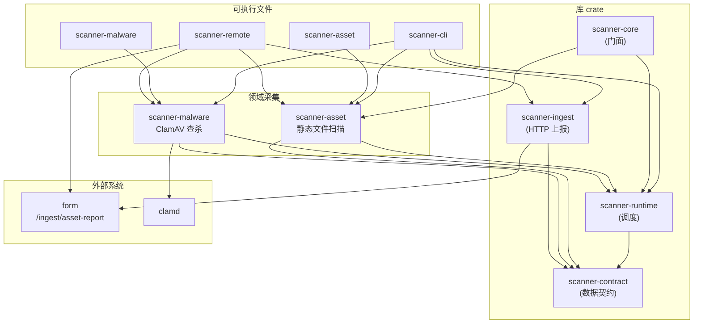

# scanner 架构

主机端 **资产与风险扫描器**，cyber-posture 平台的内视引擎。scanner **只负责采集**；CVE / 包漏洞识别由 **form** 侧对上报的 SBOM 与包清单做 OSV 匹配。

## 组件关系



## 数据流

```
挂载目录 / 本机根 (scan_root)
        │
        ▼
  Collector 计划 (Host → Packages → Services → …)
        │
        ▼
   AssetReport (JSON)
        │
        ├── stdout / --out 文件
        └── POST /ingest/asset-report → form
```

**静态扫描**（`scanner-asset`）也可按类别写出分文件 JSON（`host.json`、`packages.json` 等），供调试或远端拉取后再组装。

## Crate 职责

| Crate | 类型 | 职责 |
| --- | --- | --- |
| `scanner-contract` | 库 | Rust 侧数据契约，与 `form/schemas-json/` 对齐 |
| `scanner-runtime` | 库 | `Collector` trait、`ScanContext`、`run_scan_at` 调度 |
| `scanner-asset` | 库 + bin | 静态文件系统资产发现（包、服务、账户、SBOM 等） |
| `scanner-malware` | 库 + bin | ClamAV `INSTREAM` 病毒查杀 |
| `scanner-ingest` | 库 | 将 `AssetReport` POST 到 form |
| `scanner-core` | 库 | 向后兼容门面（`run_scan` / `run_scan_at`） |
| `scanner-cli` | bin | 组装采集计划、输出合并报告、可选上报 |
| `scanner-remote` | 库 + bin | SSH 投放静态二进制、远端执行、回传 JSON |

依赖方向：**domain → runtime → contract**；二进制通过 feature 按需启用 domain crate。

## Collector 模型

一次扫描周期内，各 `Collector` 共享 [`ScanContext`](../crates/scanner-runtime/src/collector.rs)：

| 字段 | 含义 |
| --- | --- |
| `scan_root` | 挂载根或 `/` |
| `host_id` / `host` | 由 `HostCollector` 填充，后续 collector 依赖 |
| `project_roots` | 语言包额外项目目录（venv / `node_modules`） |

`Collector::collect` 返回 [`CollectorOutput`](../crates/scanner-runtime/src/collector.rs) 之一：

- `Host(HostInfo)` — 主机描述
- `Assets(Vec<Asset>)` — 包、服务、账户、凭证等
- `Vulnerabilities(Vec<Vulnerability>)` — ClamAV 命中等

`run_scan_at` 顺序执行 collector，合并为 [`AssetReport`](../crates/scanner-contract/src/lib.rs)。

## 默认采集计划

`scanner-asset::default_collectors()`：

1. `HostCollector` — `etc/hostname`、`etc/os-release`、`proc/version`
2. `PackagesCollector` — dpkg / apk / rpm / PyPI / npm
3. `ServicesCollector` — systemd + SysV
4. `AccountsCollector` — `/etc/passwd`
5. `CredentialsCollector` — SSH 公钥指纹（不含私钥）

启用 `malware` feature 时，`scanner-cli` 追加 `MalwareCollector`。

## 数据契约

- **权威来源**：`form/src/form/schemas/`（Pydantic）
- **JSON Schema**：`form/schemas-json/`
- **Rust 镜像**：`scanner-contract`
- **校验测试**：`scanner-runtime/tests/contract.rs`、`scanner-core/tests/contract.rs`

## Feature 矩阵（scanner-cli）

| Feature | 默认 | 说明 |
| --- | --- | --- |
| `asset` | ✓ | 静态资产采集 |
| `malware` | | ClamAV 查杀 |
| `ingest` | | `--upload` 上报 form |
| `full` | | `asset` + `malware` |

## 扩展新采集器

1. 在对应 domain crate（或新建 crate）实现 `Collector`
2. 将实例加入 `default_collectors()` 或 `scanner-cli::build_plan`
3. 若产出新 asset 类型，先在 form schema 与 `scanner-contract` 中扩展
4. 在 `scanner-runtime/tests/contract.rs` 补充契约校验

详见 [`CONTRIBUTING.md`](./CONTRIBUTING.md)。
